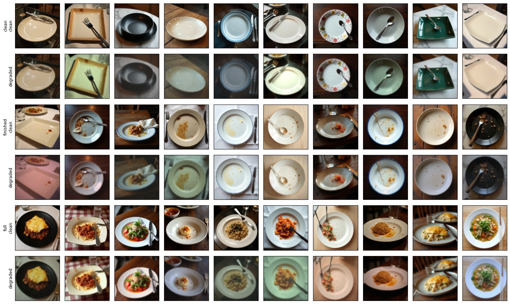
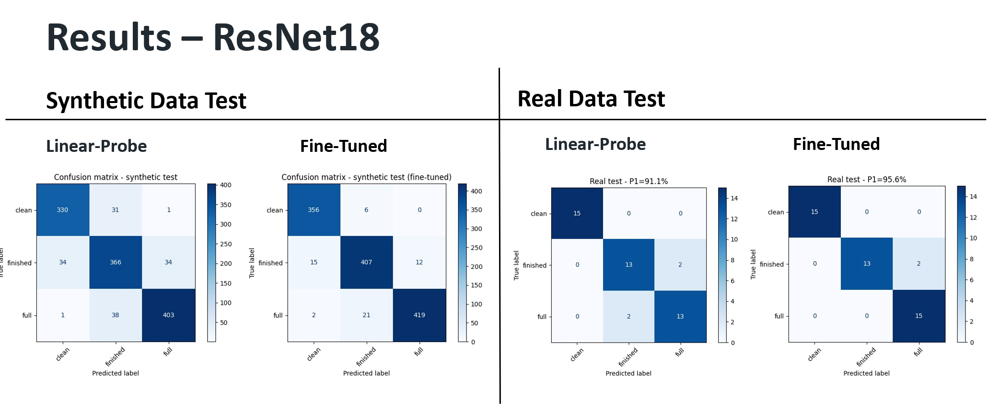
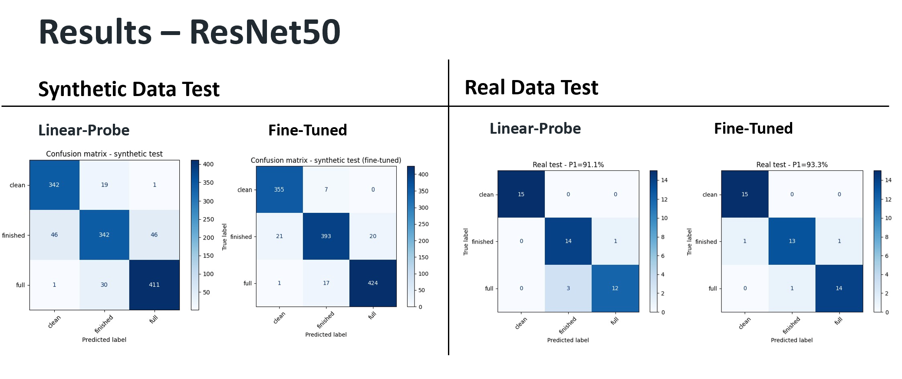

# PlateStateNet - Food Consumption Level Classification

---

## Project Motivation

In real-world restaurant environments, understanding the state of a plate (clean, finished, or full) can support automation and improve service efficiency.

However, real-world images are highly variable due to lighting, camera quality, noise, and perspective. Models trained on clean or synthetic data often fail when deployed in real conditions due to the **synthetic-to-real domain gap**.

This project investigates whether **synthetic data generation and camera-based augmentations** can improve robustness and generalization to real-world images.

---

## Problem Statement

**Input:** Plate image (clean or degraded)  
**Output:** Consumption state classification (Clean / Finished / Full)

**Goal:** Enable automated monitoring of table states in restaurant environments.

---

## Dataset

### Synthetic Data
- Generated using **FLUX.1-dev**
- ~2000 images (3 classes)
- ~300 prompts per class (high diversity)
- Fully reproducible with fixed seeds

Classes:
- Clean (empty pristine plate)
- Finished (used plate with residue)
- Full (plate with food)

### Real Data
- ~45 real-world CCTV images
- Used for evaluation (and minor tuning)

---

## Data Generation & Augmentation

### Prompt-Based Generation
- Attribute-based prompt construction
- Controlled randomness
- High variability in plate appearance

### Camera Simulation Augmentations
To bridge the synthetic → real gap:

- Low resolution (downscaling)
- Gaussian blur (defocus)
- Sensor noise
- Brightness & contrast variations
- Camera tilt & perspective shift
- Color cast (white balance changes)
- Vignette effects
- JPEG compression artifacts

These simulate the **image formation process of real cameras**.

---

## Visual Abstract

<p align="center">
  
</p>

---

## Models and Pipeline

### Models
- ResNet18 (Linear Probe + Fine-Tuning)
- ResNet50 (Linear Probe + Fine-Tuning)

### Pipeline
1. Generate synthetic data  
2. Apply augmentations  
3. Train / validation / test split  
4. Train models (LP / FT)  
5. Evaluate on synthetic and real data  

---

## Training Process

- Models trained primarily on synthetic data  
- Fine-tuning allows adaptation to task-specific features  
- Small amount of real data used to slightly improve generalization  

---

## Metrics

- Accuracy  
- Confusion Matrix  

---

## Confusion Matrix Results

### ResNet18

<p align="center">
  
</p>

### ResNet50

<p align="center">
  
</p>

---

## Model Comparison (on test data)

| Model         | Synthetic Acc | Real Acc |
|---------------|---------------|----------|
| ResNet18 (LP) | 88.9%         | 91.1%    |
| ResNet18 (FT) | 95.6%         | 95.6%    |
| ResNet50 (LP) | 88.4%         | 91.1%    |
| ResNet50 (FT) | 94.7%         | 93.3%    |

To avoid overfitting on the synthetic dataset, we applied partial fine-tuning and unfroze only the last residual block (layer4) in both models.

Due to architectural differences, this results in a larger number of trainable parameters in ResNet50 compared to ResNet18. Consequently, ResNet50 adapts more aggressively to the synthetic data, which can slightly harm generalization and lead to lower performance on real-world images.

---

## Dataset and Model weights Access

The dataset and the weights is available via Google Drive:

👉 https://drive.google.com/drive/folders/1Z3eJQl92kMzYILhjZBXS53ZeAykAkeTQ?usp=sharing

The Drive folder contains:

- Final processed datasets (after train/validation/test split)
- Real-world test samples
- Model weights


---

## Repository Structure

```
PlateStateNet/
│
├── code/                              # Main pipeline (notebooks + scripts)
│   ├── 01_generate_prompts.ipynb      # generate structured prompts  
│   ├── 02_generate_images.ipynb       # notebook version of generation  
│   ├── generate_images.py             # headless synthetic image generation (FLUX, resumable)
│   ├── 03_degrade_and_augment.ipynb   # simulate camera conditions  
│   ├── preview_degradation.py         # preview degradation without saving  
│   ├── 04_split_dataset.ipynb         # create train / val / test splits  
│   ├── 05_train_model_ResNet18.ipynb  # train and evaluate ResNet18  
│   ├── 06_train_model_ResNet50.ipynb  # train and evaluate ResNet50  
│   ├── preview_train_transform.py     # visualize training augmentations  
│   ├── make_grid.py                   # build image grids for visual QA  
│   ├── run_in_container.sh            # run full pipeline in GPU container  
│   └── utils.py                       # shared constants, paths, and core logic  
│
├── Images/                            # figures used in README  
├── visuals/                           # results, confusion matrices, training curves  
├── weights/                           # trained model checkpoints  
├── Presentations/                     # slides & reports  
│
├── README.md  
└── requirements.txt  
```

---

## How to Run

This project follows a modular pipeline.  
You can either run the full pipeline from scratch **or skip directly to training** if you use the provided dataset.

---

### 🔹 Option 1 — Full Pipeline (from scratch)

Run the following steps in order:

1. `01_generate_prompts.ipynb`  
   Generate structured prompts for image synthesis  
2. `02_generate_images.ipynb` or `generate_images.py`  
   Generate synthetic dataset using FLUX  
3. `03_degrade_and_augment.ipynb`  
   Apply realistic CCTV-style degradation  
4. `04_split_dataset.ipynb`  
   Create train / validation / test splits  
5. `05_train_model_ResNet18.ipynb`  
6. `06_train_model_ResNet50.ipynb`  

---

### 🔹 Option 2 — Train Only (recommended)

If you downloaded the dataset from Google Drive:

The data is **already split into train / val / test**

You can skip directly to:

- `05_train_model_ResNet18.ipynb`
- `06_train_model_ResNet50.ipynb`

### Important Notes

- Training notebooks (**05 / 06**) must be executed **cell-by-cell**  
  Do NOT use "Run All" — this may:
  - overload GPU memory  
  - mix LP / FT stages incorrectly  

- A GPU is strongly recommended (for both FLUX generation and training)

---

### Install Dependencies

pip install -r requirements.txt

---

## Team Members

- Shlomi Ben Shitrit  
- Yarden Aviad  
- Avital Skop  
